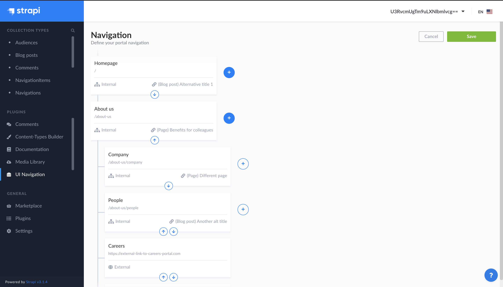
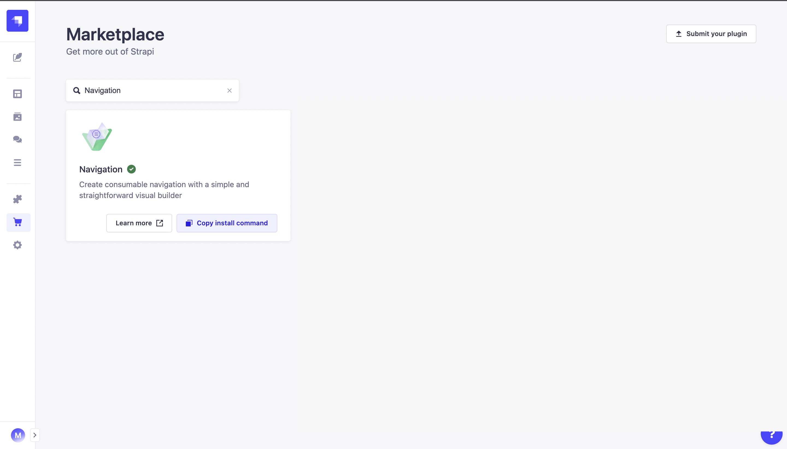
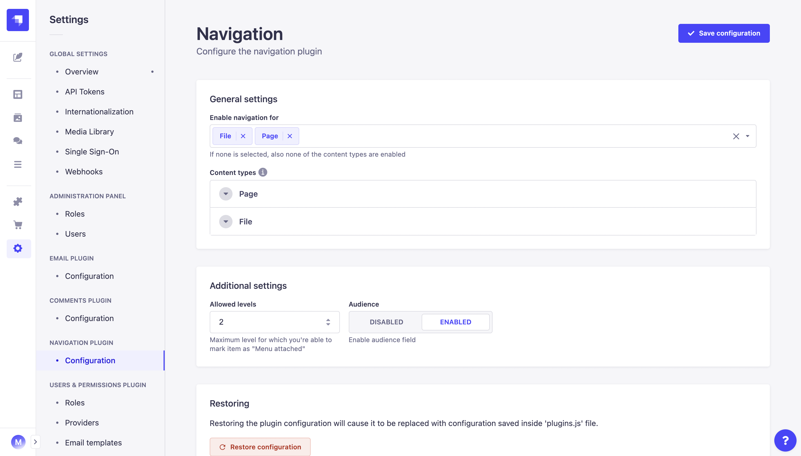

<div align="center" width="150px">
  
</div>
<div align="center">
  <h1>Strapi v4 - Navigation plugin</h1>
  <p>Create consumable navigation with a simple and straightforward visual builder</p>
  <a href="https://www.npmjs.org/package/strapi-plugin-navigation">
    
  </a>
  <a href="https://www.npmjs.org/package/strapi-plugin-navigation">
    
  </a>
  <a href="https://circleci.com/gh/VirtusLab/strapi-plugin-navigation">
    
  </a>
  <a href="https://codecov.io/gh/VirtusLab/strapi-plugin-navigation">
    
  </a>
  <a href="https://sharing.clickup.com/tl/xhcmx-43/strapiv-4-navigation-roadmap">
    
  </a>
  <a href="https://sharing.clickup.com/b/6-169004201-2/strapiv-4-navigation-board">
    
  </a>
</div>

---

<div style="margin: 20px 0" align="center">
  
</div>

Strapi Navigation Plugin provides a website navigation / menu builder feature for [Strapi Headless CMS](https://github.com/strapi/strapi) admin panel. Navigation has the possibility to control the audience and can be consumed by the website with different output structure renderers:

- Flat
- Tree (nested)
- RFR (ready for handling by Redux First Router)

### Table of Contents
1. [✨ Features](#-features)
2. [⏳ Installation](#-installation)
3. [🖐 Requirements](#-requirements)
4. [🔧 Basic Configuration](#-configuration)
   - [Settings page](#in-v203-and-newer)
   - [Plugin file](#in-v202-and-older--default-configuration-state-for-v203-and-newer)
5. [🔧 GraphQL Configuration](#-gql-configuration)
6. [🕸️ Public API specification](#%EF%B8%8F-public-api-specification)
   - [REST API](#rest-api) 
   - [GraphQL API](#graphql-api)
8. [💬 FAQ](#-faq)
9. [🤝 Contributing](#-contributing)
10. [👨‍💻 Community support](#-community-support)

## ✨ Features

- **Navigation Public API:** Simple and ready for use API endpoint for consuming the navigation structure you've created
- **Visual builder:** Elegant and easy to use visual builder
- **Any Content Type relation:** Navigation can by linked to any of your Content Types by default. Simply, you're controlling it and also limiting available content types by configuration props
- **Different types of navigation items:** Create navigation with items linked to internal types, to external links or wrapper elements to keep structure clean 
- **Multiple navigations:** Create as many Navigation containers as you want, setup them and use in the consumer application
- **Light / Dark mode compatible:** By design we're supporting Strapi ☀️ Light / 🌙 Dark modes 
- **Customizable:** Possibility to customize the options like: available Content Types, Maximum level for "attach to menu", Additional fields (audience)
- **[Audit log](https://github.com/VirtusLab/strapi-molecules/tree/master/packages/strapi-plugin-audit-log):** integration with Strapi Molecules Audit Log plugin that provides changes track record

## ⚙️ Versions

- **Strapi v4** - (current) - [v2.x](https://github.com/VirtusLab-Open-Source/strapi-plugin-navigation)
- **Strapi v3** - [v1.x](https://github.com/VirtusLab-Open-Source/strapi-plugin-navigation/tree/strapi-v3)

## ⏳ Installation

### Via Strapi Markerplace

As a ✅ **verified** plugin by Strapi team we're available on the [**Strapi Marketplace**](https://market.strapi.io/plugins/strapi-plugin-navigation) as well as **In-App Marketplace** where you can follow the installation instructions.

<div style="margin: 20px 0" align="center">
  
</div>

### Via command line

It's recommended to use **yarn** to install this plugin within your Strapi project. [You can install yarn with these docs](https://yarnpkg.com/lang/en/docs/install/).

```bash
yarn add strapi-plugin-navigation@latest
```

After successful installation you've to re-build your Strapi instance. To archive that simply use:

```bash
yarn build
yarn develop
```

or just run Strapi in the development mode with `--watch-admin` option:

```bash
yarn develop --watch-admin
```

The **UI Navigation** plugin should appear in the **Plugins** section of Strapi sidebar after you run app again.

As a next step you must configure your the plugin by the way you want to. See [**Configuration**](#🔧-configuration) section.

All done. Enjoy 🎉

## 🖐 Requirements

Complete installation requirements are exact same as for Strapi itself and can be found in the documentation under <a href="https://docs.strapi.io/developer-docs/latest/setup-deployment-guides/installation/cli.html#preparing-the-installation">Installation Requirements</a>.

**Supported Strapi versions**:

- Strapi v4.1.8 (recently tested)
- Strapi v4.x

> This plugin is designed for **Strapi v4** and is not working with v3.x. To get version for **Strapi v3** install version [v1.x](https://github.com/VirtusLab-Open-Source/strapi-plugin-navigation/tree/strapi-v3).

**We recommend always using the latest version of Strapi to start your new projects**.

## 🔧 Configuration

To start your journey with **Navigation plugin** you must first setup it using the dedicated Settings page (`v2.0.3` and newer) or for any version, put your configuration in `config/plugins.js`. Anyway we're recommending the click-through option where your configuration is going to be properly validated.

### In `v2.0.3` and newer

Version `2.0.3` introduces the intuitive **Settings** page which you can easily access via `Strapi Settings -> Section: Navigation Plugin -> Configuration`. 

On the dedicated page, you will be able to set up all crucial properties which drive the plugin and customize each individual collection for which **Navigation plugin** should be enabled.

<div style="margin: 20px 0" align="center">
  
</div>

> *Note*
> The default configuration for your plugin is fetched from `config/plugins.js` or, if the file is not there, directly from the plugin itself. If you would like to customize the default state to which you might revert, please follow the next section.

### In `v2.0.2` and older + default configuration state for `v2.0.3` and newer

Config for this plugin is stored as a part of the `config/plugins.js` or `config/<env>/plugins.js` file. You can use the following snippet to make sure that the config structure is correct. If you've got already configurations for other plugins stores by this way, you can use the `navigation` along with them. 

> *Note v2.0.3 and newer only*
> Changing this file will not automatically change plugin configuration. To synchronize plugin's config with plugins.js file, it is necessary to restore configuration through the settings page 

```js
    module.exports = ({ env }) => ({
        // ...
        navigation: {
            enabled: true,
            config: {
                additionalFields: ['audience'],
                contentTypes: ['api::page.page'],
                contentTypesNameFields: {
                    'api::page.page': ['title']
                },
                allowedLevels: 2,
                gql: {...},
            }
        }
    });
```

### Properties
- `additionalFields` - Additional fields: 'audience', more in the future
- `allowedLevels` - Maximum level for which you're able to mark item as "Menu attached"
- `contentTypes` - UIDs of related content types
- `contentTypesNameFields` - Definition of content type title fields like `'api::<collection name>.<content type name>': ['field_name_1', 'field_name_2']`, if not set titles are pulled from fields like `['title', 'subject', 'name']`. **TIP** - Proper content type uid you can find in the URL of Content Manager where you're managing relevant entities like: `admin/content-manager/collectionType/< THE UID HERE >?page=1&pageSize=10&sort=Title:ASC&plugins[i18n][locale]=en`
- `gql` - If you're using GraphQL that's the right place to put all necessary settings. More **[ here ](#gql-configuration)**

## 🔧 GQL Configuration
Using navigation with GraphQL requires both plugins to be installed and working. You can find installation guide for GraphQL plugin **[here](https://docs.strapi.io/developer-docs/latest/plugins/graphql.html#graphql)**.  To properly configure GQL to work with navigation you should provide `gql` prop. This should contain union types that will be used to define GQL response format for your data while fetching:

> **Important!**
> If you're using `config/plugins.js` to configure your plugins , please put `navigation` property before `graphql`. Otherwise types are not going to be properly added to GraphQL Schema. That's because of dynamic types which base on plugin configuration which are added on `bootstrap` stage, not `register`. This is not valid if you're using `graphql` plugin without any custom configuration, so most of cases in real.

```gql
master: Int
items: [NavigationItem]
related: NavigationRelated
```

This prop should look as follows:   

```js
gql: {
    navigationItemRelated: ['<your GQL related content types>'],
},
```

for example:   

```js
gql: {
    navigationItemRelated: ['Page', 'UploadFile'],
},
```
where `Page` and `UploadFile` are your type names for the **Content Types** you're referring by navigation items relations. 

## 👤 RBAC
Plugin provides granular permissions based on Strapi RBAC functionality.

### Mandatory permissions
For any role different than **Super Admin**, to access the **Navigation panel** you must set following permissions:
- _Plugins_ -> _Navigation_ -> _Read_ - gives you the access to **Navigation Panel**

## Base Navigation Item model

### Flat
```json
{
    "id": 1,
    "title": "News",
    "type": "INTERNAL",
    "path": "news",
    "externalPath": null,
    "uiRouterKey": "News",
    "menuAttached": false,
    "parent": 8, // Parent Navigation Item 'id', null in case of root level
    "master": 1, // Navigation 'id'
    "createdAt": "2020-09-29T13:29:19.086Z",
    "updatedAt": "2020-09-29T13:29:19.128Z",
    "related": {/*<Content Type model >*/ },
    "audience": []
}
```

### Tree
```json
{
    "title": "News",
    "menuAttached": true,
    "path": "/news",
    "type": "INTERNAL",
    "uiRouterKey": "news",
    "slug": "benefits",
    "external": false,
    "related": {
        // <Content Type model >
    },
    "items": [
        {
            "title": "External url",
            "menuAttached": true,
            "path": "http://example.com",
            "type": "EXTERNAL",
            "uiRouterKey": "generic",
            "external": true
        },
       //  < Tree Navigation Item models >
    ]
}
```

### RFR
```json
{
    "id": "News",
    "title": "News",
    "templateName": "pages:1",
    "related": {
        "contentType": "page",
        "collectionName": "pages",
        "id": 1
    },
    "path": "/news",
    "slug": "news",
    "parent": null, // Parent Navigation Item 'id', null in case of root level
    "menuAttached": true
}
```

## 🕸️ Public API specification

Plugin supports both **REST API** and **GraphQL API** exposed by Strapi.

**Query Params**

- `navigationIdOrSlug` - ID or slug for which your navigation structure is generated like for REST API:

  > `https://localhost:1337/api/navigation/render/1`
  > `https://localhost:1337/api/navigation/render/main-menu`

- `type` - Enum value representing structure type of returned navigation:
  > `https://localhost:1337/api/navigation/render/1?type=FLAT`

- `menu` (`menuOnly` for GQL) - Boolean value for querying only navigation items that are attached to menu should be rendered eg.
  > `https://localhost:1337/api/navigation/render/1?menu=true`

- `path` - String value for querying navigation items by its path:
  > `https://localhost:1337/api/navigation/render/1?path=/home/about-us`

### REST API

> **Important!**
> Version `v2.0.13` introduced breaking change!
> All responses have changed their structure. Related field will now be of type ContentType instead of Array\<ContentType\>

`GET <host>/api/navigation/render/<navigationIdOrSlug>?type=<type>`

Return a rendered navigation structure depends on passed type (`tree`, `rfr` or nothing to render as `flat/raw`).

> The ID of navigation by default is `1`, if you've got defined multiple navigations you must work with their IDs or Slugs to fetch.

**Example URL**: `https://localhost:1337/api/navigation/render/1`

**Example response body**

```json
[
    {
        "id": 1,
        "title": "News",
        "type": "INTERNAL",
        "path": "news",
        "externalPath": null,
        "uiRouterKey": "News",
        "menuAttached": false,
        "parent": null,
        "master": 1,
        "created_at": "2020-09-29T13:29:19.086Z",
        "updated_at": "2020-09-29T13:29:19.128Z",
        "related": {
            "__contentType": "Page",
            "id": 1,
            "title": "News",
            // ...
        }
    },
    // ...
]
```

**Example URL**: `https://localhost:1337/api/navigation/render/1?type=tree`

**Example response body**

```json
[
    {
        "title": "News",
        "menuAttached": true,
        "path": "/news",
        "type": "INTERNAL",
        "uiRouterKey": "news",
        "slug": "benefits",
        "external": false,
        "related": {
            "__contentType": "Page",
            "id": 1,
            "title": "News",
            // ...
        },
        "items": [
            {
                "title": "External url",
                "menuAttached": true,
                "path": "http://example.com",
                "type": "EXTERNAL",
                "uiRouterKey": "generic",
                "external": true
            },
            // ...
        ]
    },
    // ...
]
```

**Example URL**: `https://localhost:1337/api/navigation/render/1?type=rfr`

**Example response body**

```json
{
    "pages": {
        "News": {
            "id": "News",
            "title": "News",
            "templateName": "pages:1",
            "related": {
                "contentType": "page",
                "collectionName": "pages",
                "id": 1
            },
            "path": "/news",
            "slug": "news",
            "parent": null,
            "menuAttached": true
        },
        "Community": {
            "id": "Community",
            "title": "Community",
            "templateName": "pages:2",
            "related": {
                "contentType": "page",
                "collectionName": "pages",
                "id": 2
            },
            "path": "/community",
            "slug": "community",
            "parent": null,
            "menuAttached": true
        },
        "Highlights": {
            "id": "Highlights",
            "title": "Highlights",
            "templateName": "pages:3",
            "related": {
                "contentType": "page",
                "collectionName": "pages",
                "id": 3
            },
            "path": "/community/highlights",
            "slug": "community-highlights",
            "parent": "Community",
            "menuAttached": false
        },
        // ...
    },
    "nav": {
        "root": [
            {
                "label": "News",
                "type": "internal",
                "page": "News"
            },
            {
                "label": "Community",
                "type": "internal",
                "page": "Community"
            },
            {
                "label": "External url",
                "type": "external",
                "url": "http://example.com"
            },
            // ...
        ],
        "Community": [
            {
                "label": "Highlights",
                "type": "internal",
                "page": "Highlights"
            },
            // ...
        ],
        // ...
    }
}
```

### GraphQL API

Same as [**REST API**](#rest-api) returns a rendered navigation structure depends on passed type (`tree`, `rfr` or nothing to render as `flat/raw`).

**Example request**

```graphql
query {
  renderNavigation(
    navigationIdOrSlug: "main-navigation"
    type: TREE
    menuOnly: false
  ) {
    id
    title
    path
    related {
      __typename

      ... on Page {
        Title
      }

      ... on WithFlowType {
        Name
      }
    }
    items {
      id
      title
      path
      related {
        __typename

        ... on Page {
          Title
        }

        ... on WithFlowType {
          Name
        }
      }
    }
  }
}
```

**Example response**

```json
{
  "data": {
    "renderNavigation": [
      {
        "id": 8,
        "title": "Test page",
        "path": "/test-path",
        "related": {
          "__typename": "WithFlowType",
          "Name": "Test"
        },
        "items": [
          {
            "id": 11,
            "title": "Nested",
            "path": "/test-path/nested-one",
            "related": {
              "__typename": "Page",
              "Title": "Eg. Page title"
            }
          }
        ]
      },
      {
        "id": 10,
        "title": "Another page",
        "path": "/another",
        "related": {
          "__typename": "Page",
          "Title": "dfdfdf"
        },
        "items": []
      }
    ]
  }
}
```

### Template name

Depending on a content type `templateName` will be resolved differently

For collection types it will be read from content type's attribute name `template` holding a component which definition has option named `templateName`.

For single types a global name of this content type will be used as a template name or it can be set manually with an option named `templateName`.

## 🧩 Examples

Live example of plugin usage can be found in the [VirtusLab Strapi Examples](https://github.com/VirtusLab/strapi-examples/tree/master/strapi-plugin-navigation) repository.

## 💬 FAQ

### GraphQL tricks

**Q:** I would like to use GraphQL schemas but I'm not getting renderNavigation query or even proper types as Navigation, NavigationItem etc. What should I do?

**A:** There is a one trick you might try. Strapi by default is ordering plugins by the way which takes `strapi-plugin-graphql` to initialize earlier than other plugins so types might not be injected. If you don't have it yet, please create `config/plugins.js` file and put there at lease following lines:

```js
module.exports = {
  'navigation': { enabled: true },
  'graphql': { enabled: true },
};
```

If you already got it, make sure that `navigation` plugin is inserted before `graphql`. That should do the job.

## 🤝 Contributing

<div>
  <a href="https://sharing.clickup.com/tl/xhcmx-43/strapiv-4-navigation-roadmap">
    
  </a>
  <a href="https://sharing.clickup.com/b/6-169004201-2/strapiv-4-navigation-board">
    
  </a>
</div>

Feel free to fork and make a Pull Request to this plugin project. All the input is warmly welcome!

## 👨‍💻 Community support

For general help using Strapi, please refer to [the official Strapi documentation](https://strapi.io/documentation/). For additional help, you can use one of these channels to ask a question:

- [Discord](https://discord.strapi.io/) We're present on official Strapi Discord workspace. Find us by `[VirtusLab]` prefix and DM.
- [Slack - VirtusLab Open Source](https://virtuslab-oss.slack.com) We're present on a public channel #strapi-molecules
- [GitHub](https://github.com/VirtusLab/strapi-plugin-navigation/issues) (Bug reports, Contributions, Questions and Discussions)
- [E-mail](mailto:strapi@virtuslab.com) - we will respond back as soon as possible

## 📝 License

[MIT License](LICENSE.md) Copyright (c) [VirtusLab Sp. z o.o.](https://virtuslab.com/) &amp; [Strapi Solutions](https://strapi.io/).
